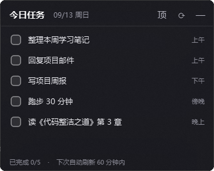
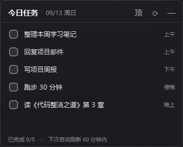
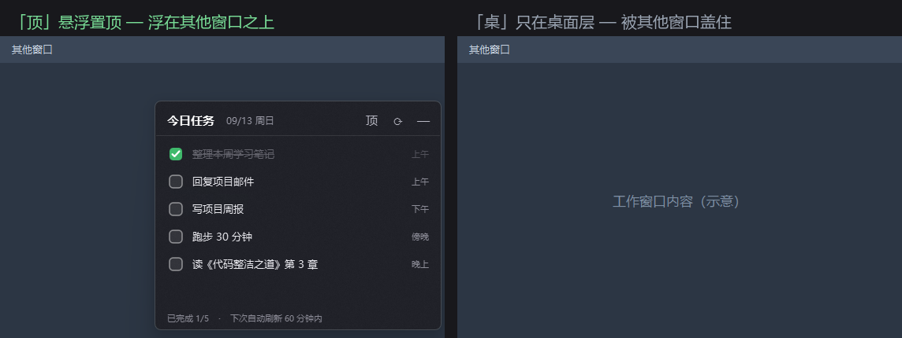
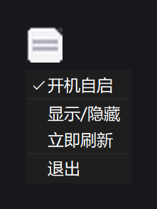

# notion-today-widget

一块常驻 Win11 桌面右上角的毛玻璃便签，只显示 Notion 数据库里**今天**的任务。

勾选框点一下实时回写 Notion，点任务名跳转 Notion 页面，手动刷新 + 跨天自动切换，托盘常驻。

> [!NOTE]
> 仅支持 **Windows**。代码依赖 `winreg` 和多个 Win32 未公开接口，macOS / Linux 上会在导入阶段直接失败。

<p align="center">
  
</p>

## 为什么做这个

用 Notion 管计划的人，每天想看「今天要做什么」的流程是：打开浏览器 → 登录 → 找到那个数据库 → 加筛选条件。

四步。这个挂件把它压成「抬头看一眼」。

## 效果

**勾选即同步**（点勾选框 → 回写 Notion；同步失败会自动把勾拨回去）



**层级可切换**（「顶」= 悬浮置顶，浮在其他窗口之上；「桌」= 只在桌面层，被其他窗口盖住）



**托盘常驻**（右键托盘图标，含「开机自启」开关）



> [!NOTE]
> 截图里的任务（整理本周学习笔记、写项目周报等）是**演示数据**，不是作者的真实日程。界面元素均为真实运行效果。

## 快速开始

```bash
# 1. 装依赖
pip install -r requirements.txt

# 2. 准备配置
cp config.example.json config.json
# 编辑 config.json，填入你的 Notion 集成令牌和数据库 ID

# 3. 运行
python notion_widget.py
```

### 配置字段

| 字段 | 含义 |
|---|---|
| `token` | Notion 内部集成令牌。在 [notion.so/my-integrations](https://www.notion.so/my-integrations) 创建，**记得把目标数据库共享给这个集成**，否则查询会返回空 |
| `database_id` | 目标数据库 ID |
| `notion_version` | Notion API 版本，默认 `2022-06-28` |
| `refresh_minutes` | 自动刷新间隔（分钟） |
| `on_top` | `true` = 悬浮置顶，`false` = 只在桌面层（也可用标题栏「顶 / 桌」按钮切换） |
| `width` / `pos` | 窗口宽度 / 左上角坐标（拖动标题栏后自动保存） |
| `acrylic_color` | 毛玻璃底色，AARRGGBB 格式 |

### 数据库要求

需要六个属性，**名称固定**（硬编码在源码里）：

| 属性名 | 类型 |
|---|---|
| `任务` | title |
| `时段` | rich_text |
| `类型` | select |
| `完成` | checkbox |
| `日期` | date |
| `提醒` | number |

挂件查询 `日期` 等于当天的记录，按 `提醒` 升序排列。

## 打包成 exe

```powershell
pip install pyinstaller
.\tools\build.ps1
```

或手动：

```powershell
pyinstaller --noconfirm --clean notion-today-widget.spec
Copy-Item app.ico dist\notion-today-widget\
Copy-Item config.example.json dist\notion-today-widget\config.json
```

> [!WARNING]
> 手动打包时**不要**把含真实令牌的 `config.json` 拷进 `dist\`。那个文件夹是要整体分发的产物，
> 拷进去等于把令牌一起发出去。`tools\build.ps1` 默认只放占位配置，并会在发现非占位内容时中止构建。

产出是 **onedir** 形式（不是 onefile）：`dist\notion-today-widget\` 整个文件夹是一个整体，分发时要一起搬。

> onefile 每次启动都要把整个 PyQt6 解包到临时目录，对一个开机自启的常驻程序来说启动太慢，所以选了 onedir。

## 技术栈

- **Python 3.11** + **PyQt6** —— GUI
- **Notion REST API**（`2022-06-28`）—— 用原生 `urllib`，无第三方 SDK
- **ctypes + Win32 未公开接口** —— 毛玻璃（`SetWindowCompositionAttribute`）、圆角（`DwmSetWindowAttribute`）、不抢焦点（`WS_EX_NOACTIVATE`）、Z 序（`SetWindowPos`）
- **PyInstaller** —— onedir 打包

## 这个项目里真正值得看的

功能代码占不到一半，其余都是平台细节。如果你也在 Win11 上用 PyQt + 网络请求 + `pythonw` 打包，**建议先读源码顶部的注释块**——那里记录了三个只在特定环境下才现形的坑（下面是补充后的四条）：

### 1. `pythonw` 下的必现崩溃

代理软件注入的 Winsock LSP × 已加载的 Qt6 DLL × 由子线程创建首个 socket，三者叠加会在 `socket()` 处触发 access violation。

解法分三层（预导入依赖链、主线程抢占 Winsock 初始化、SSL context 复用），最后做了一个架构退让：**把网络请求整个搬回主线程**，用 `QTimer` 延迟 40ms 触发以保证「加载中…」先绘制。代价是刷新时阻塞 1~2 秒，用「每小时才刷新一次」把这个代价压到可接受。

相关代码：`notion_widget.py` 文件头 L12-25、`_SSL_CTX`（L68）、`run_net()`（L103-112）。

### 2. `SetWindowPos` 的 `argtypes` 必须声明

64 位下不声明 `argtypes`，ctypes 会按 C 默认规则把 `HWND(-1)`（`HWND_TOPMOST`）截断成无效句柄。后果是**函数不报错、不抛异常，置顶功能就是不生效**——比崩溃更难查。

相关代码：`notion_widget.py` L146-148。

### 3. 毛玻璃接口要的是 ABGR，不是 AARRGGBB

`SetWindowCompositionAttribute` 的 `GradientColor` 字段字节序是 ABGR，红蓝通道相反。不重排的话，配好的深灰会显示成蓝色。

相关代码：`aarrggbb_to_abgr()`（`notion_widget.py` L121-123）。

### 4. 别重写 `nativeEvent`

PyQt 6.11 下重写它会在窗口创建的早期阶段触发 access violation。跨天/最小化的兜底走 `changeEvent` 就够了。

相关代码：`notion_widget.py` L365-374。

## 已知限制

- **`refresh_minutes` 没有接到定时器上。** 这个配置项只出现在状态栏文案里（「下次自动刷新 N 分钟内」），实际上不会按该间隔刷新。真实刷新时机只有四个：启动时、点 ⟳、托盘「立即刷新」、跨天时。**状态栏那句话目前是失实的。**
- 首次运行若没有 `config.json`，程序会静默退出（无窗口、无提示），退出码 0。请先按「快速开始」建好配置。
- 默认窗口位置 `(1792, 378)` 是按 2160 宽的屏幕定的。在 1920 宽屏上窗口会大部分落在屏幕外——首次运行若看不到挂件，手动把 `config.json` 里的 `pos` 改小即可。
- 数据库属性名硬编码（`任务` / `时段` / `类型` / `完成` / `日期` / `提醒`），换数据库需要改源码。
- 无测试，验证靠人工。
- 无单实例保护：重复启动会产生两份挂件、两个托盘图标，并同时写同一个 `config.json`。
- `config.json` 明文存令牌（本地个人使用场景；若要多人/多机部署，建议改用系统凭据管理器）。
- 不抢焦点靠 `WS_EX_NOACTIVATE`；不出现在 Alt+Tab 里是 `WS_EX_TOOLWINDOW` 的效果。两个标志都设了，对挂件来说都是期望行为。

## License

[MIT](LICENSE)
